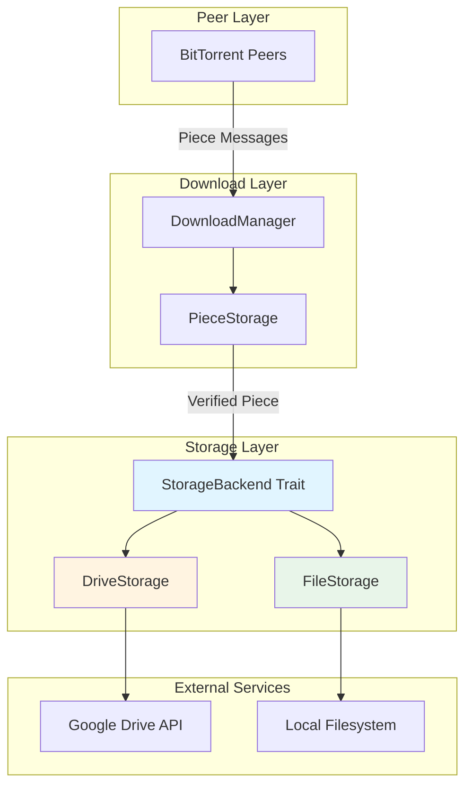
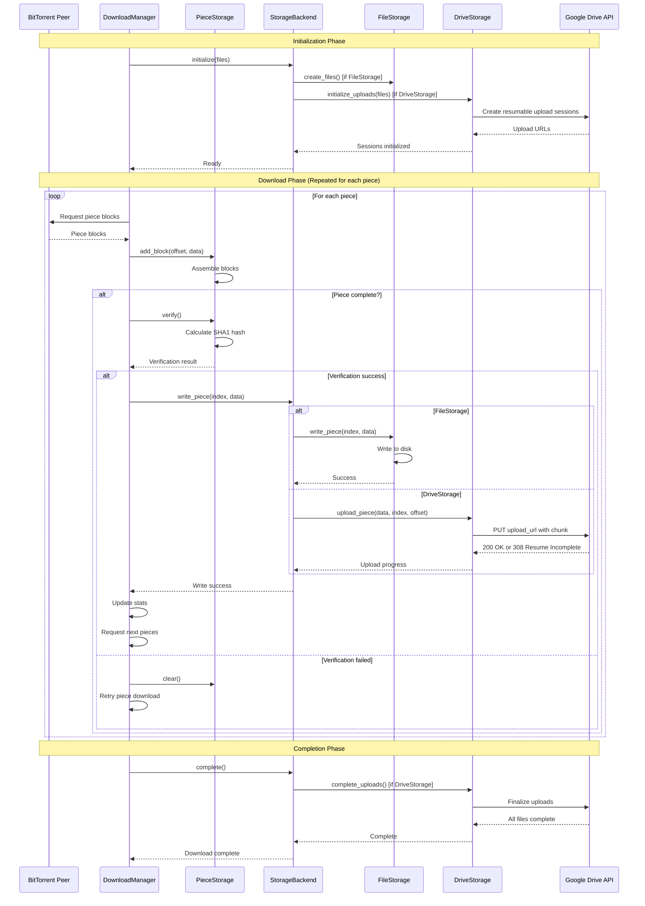
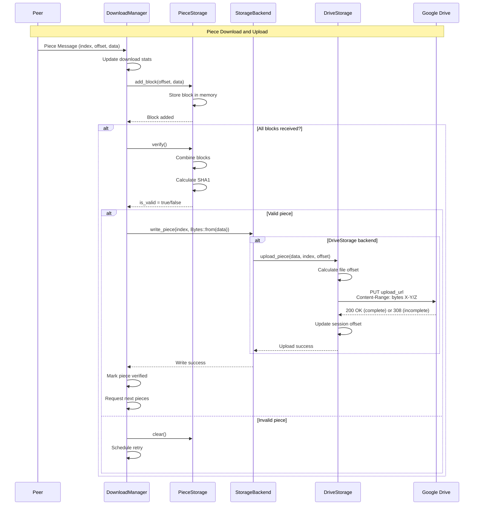
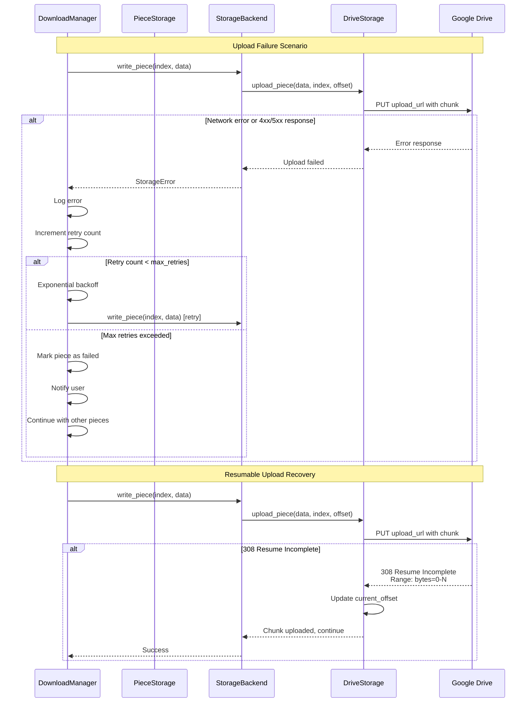

# Streaming BitTorrent to Google Drive Architecture

## Executive Summary

This document outlines the architecture for streaming BitTorrent files directly to Google Drive without storing any bytes on the local hard drive. The solution introduces a `StorageBackend` trait to abstract storage operations, enabling both traditional file-based downloads and in-memory streaming to cloud storage.

## Table of Contents

1. [Current State Analysis](#current-state-analysis)
2. [Architecture Overview](#architecture-overview)
3. [StorageBackend Trait Design](#storagebackend-trait-design)
4. [Modified DownloadManager Architecture](#modified-downloadmanager-architecture)
5. [Data Flow Sequence](#data-flow-sequence)
6. [Code Structure and Modifications](#code-structure-and-modifications)
7. [Error Handling Strategy](#error-handling-strategy)
8. [Memory Management](#memory-management)
9. [Implementation Phases](#implementation-phases)

---

## Current State Analysis

### Existing Components

#### 1. DriveStorage ([`src/storage/drive.rs`](src/storage/drive.rs))
- **Status**: Fully implemented, supports in-memory streaming
- **Key Features**:
  - Resumable upload sessions via Google Drive API
  - Chunk-based uploads with Content-Range headers
  - No disk writes - operates entirely in memory
  - Support for multiple files with upload session tracking
- **Current Usage**: Only used in examples, not integrated into main download flow
- **Key Methods**:
  - [`initialize_uploads()`](src/storage/drive.rs:257) - Creates upload sessions for all files
  - [`upload_piece()`](src/storage/drive.rs:301) - Uploads a piece directly to Drive
  - [`complete_uploads()`](src/storage/drive.rs:350) - Finalizes all uploads

#### 2. DownloadManager ([`src/storage/download.rs`](src/storage/download.rs))
- **Status**: Tightly coupled to FileStorage
- **Key Issues**:
  - Line 112: Hardcoded `Arc<RwLock<FileStorage>>` dependency
  - Line 384: Direct disk write via `storage.write_piece(piece_index, &piece_data)`
  - No abstraction for different storage backends
- **Key Methods**:
  - [`handle_piece_message()`](src/storage/download.rs:334) - Receives piece data from peers
  - Piece verification happens in memory before storage
  - Currently writes verified pieces to disk

#### 3. FileStorage ([`src/storage/file.rs`](src/storage/file.rs))
- **Status**: Fully implemented, disk-based storage
- **Key Methods**:
  - [`write_piece()`](src/storage/file.rs:143) - Writes piece to disk
  - [`create_files()`](src/storage/file.rs:61) - Creates sparse files
  - [`read_piece()`](src/storage/file.rs:216) - Reads piece from disk

#### 4. PieceStorage ([`src/storage/piece.rs`](src/storage/piece.rs))
- **Status**: Shared component, works with any storage backend
- **Key Features**:
  - In-memory piece assembly from blocks
  - SHA1 hash verification
  - Block-level tracking
- **Key Methods**:
  - [`add_block()`](src/storage/piece.rs:90) - Adds block to piece
  - [`verify()`](src/storage/piece.rs:107) - Verifies piece hash
  - [`is_complete()`](src/storage/piece.rs:102) - Checks if all blocks received

### Integration Gap

**Current Flow**:
```
Peer → DownloadManager → PieceStorage (in-memory) → FileStorage (disk write)
```

**Desired Flow**:
```
Peer → DownloadManager → PieceStorage (in-memory) → StorageBackend (disk OR Drive)
```

---

## Architecture Overview

### Design Principles

1. **Zero Disk Writes**: Google Drive storage must not write to local disk
2. **Backward Compatibility**: Existing file-based downloads must continue working
3. **Trait-Based Abstraction**: Use Rust traits for flexible storage backends
4. **Piece Verification First**: Always verify pieces before storage
5. **Resumable Uploads**: Support interrupted upload recovery
6. **Memory Efficiency**: Minimize memory usage for large files

### High-Level Architecture



### Key Abstractions

#### StorageBackend Trait
The central abstraction that enables pluggable storage backends:

```rust
pub trait StorageBackend: Send + Sync {
    /// Initialize storage for the torrent
    async fn initialize(&mut self, files: &[TorrentFile]) -> Result<()>;
    
    /// Write a verified piece to storage
    async fn write_piece(&mut self, piece_index: u32, data: Bytes) -> Result<()>;
    
    /// Check if download is complete
    fn is_complete(&self) -> bool;
    
    /// Get download progress (0.0 to 1.0)
    fn get_progress(&self) -> f64;
    
    /// Get piece storage for verification
    fn pieces(&self) -> &PieceStorage;
    
    /// Get mutable piece storage
    fn pieces_mut(&mut self) -> &mut PieceStorage;
    
    /// Create file structure (for FileStorage)
    async fn create_files(&self) -> Result<()>;
    
    /// Complete all uploads (for DriveStorage)
    async fn complete(&self) -> Result<()>;
    
    /// Get storage type identifier
    fn storage_type(&self) -> StorageType;
}

pub enum StorageType {
    File,
    Drive,
}
```

---

## StorageBackend Trait Design

### Trait Definition

```rust
/// Abstract storage backend for torrent data
///
/// This trait allows DownloadManager to work with different storage backends
/// without knowing implementation details. Implementations can store data
/// to disk, cloud storage, or any other destination.
#[async_trait::async_trait]
pub trait StorageBackend: Send + Sync {
    // ==================== Lifecycle Methods ====================
    
    /// Initialize storage for the torrent
    ///
    /// For FileStorage: Creates sparse files on disk
    /// For DriveStorage: Creates resumable upload sessions
    async fn initialize(&mut self, files: &[TorrentFile]) -> Result<()>;
    
    /// Complete all storage operations
    ///
    /// For FileStorage: No-op (files already written)
    /// For DriveStorage: Finalizes upload sessions
    async fn complete(&self) -> Result<()>;
    
    // ==================== Piece Operations ====================
    
    /// Write a verified piece to storage
    ///
    /// This method is called after piece verification succeeds.
    /// Implementations must handle the piece data without modification.
    ///
    /// # Arguments
    /// * `piece_index` - Index of the piece in the torrent
    /// * `data` - Verified piece data as Bytes (zero-copy friendly)
    ///
    /// # Requirements
    /// - Must not modify the piece data
    /// - Must handle piece data in-memory (no disk writes for DriveStorage)
    /// - Must support resumable operations (DriveStorage)
    async fn write_piece(&mut self, piece_index: u32, data: Bytes) -> Result<()>;
    
    /// Read a piece from storage (for verification/resume)
    ///
    /// For FileStorage: Reads from disk
    /// For DriveStorage: Returns cached piece data or error (not readable from Drive)
    async fn read_piece(&self, piece_index: u32) -> Result<Option<Bytes>>;
    
    // ==================== Progress Tracking ====================
    
    /// Check if download is complete
    fn is_complete(&self) -> bool;
    
    /// Get download progress (0.0 to 1.0)
    fn get_progress(&self) -> f64;
    
    /// Get the number of verified pieces
    fn verified_count(&self) -> usize;
    
    /// Get total piece count
    fn total_pieces(&self) -> usize;
    
    // ==================== Piece Storage Access ====================
    
    /// Get piece storage for verification
    fn pieces(&self) -> &PieceStorage;
    
    /// Get mutable piece storage
    fn pieces_mut(&mut self) -> &mut PieceStorage;
    
    // ==================== Metadata ====================
    
    /// Get storage type identifier
    fn storage_type(&self) -> StorageType;
    
    /// Get storage-specific metadata
    fn metadata(&self) -> StorageMetadata;
}

/// Storage type enumeration
#[derive(Debug, Clone, Copy, PartialEq, Eq)]
pub enum StorageType {
    /// Local filesystem storage
    File,
    /// Google Drive cloud storage
    Drive,
}

/// Storage-specific metadata
#[derive(Debug, Clone)]
pub struct StorageMetadata {
    pub storage_type: StorageType,
    pub base_path: Option<PathBuf>,
    pub drive_folder_id: Option<String>,
    pub total_size: u64,
    pub piece_count: usize,
}
```

### Implementation Requirements

#### FileStorage Implementation

```rust
impl StorageBackend for FileStorage {
    async fn initialize(&mut self, _files: &[TorrentFile]) -> Result<()> {
        // Already implemented in create_files()
        self.create_files().await
    }
    
    async fn write_piece(&mut self, piece_index: u32, data: Bytes) -> Result<()> {
        // Convert Bytes to Vec<u8> for compatibility
        self.write_piece(piece_index, data.as_ref()).await
    }
    
    async fn read_piece(&self, piece_index: u32) -> Result<Option<Bytes>> {
        let data = self.read_piece(piece_index).await?;
        Ok(Some(Bytes::from(data)))
    }
    
    async fn complete(&self) -> Result<()> {
        // No-op for file storage
        Ok(())
    }
    
    fn is_complete(&self) -> bool {
        self.pieces().is_complete()
    }
    
    fn get_progress(&self) -> f64 {
        self.pieces().progress()
    }
    
    fn pieces(&self) -> &PieceStorage {
        &self.pieces
    }
    
    fn pieces_mut(&mut self) -> &mut PieceStorage {
        &mut self.pieces
    }
    
    fn storage_type(&self) -> StorageType {
        StorageType::File
    }
    
    fn metadata(&self) -> StorageMetadata {
        StorageMetadata {
            storage_type: StorageType::File,
            base_path: Some(self.base_path.clone()),
            drive_folder_id: None,
            total_size: self.torrent_info.total_size(),
            piece_count: self.pieces.piece_count(),
        }
    }
}
```

#### DriveStorage Implementation

```rust
impl StorageBackend for DriveStorage {
    async fn initialize(&mut self, files: &[TorrentFile]) -> Result<()> {
        // Already implemented in initialize_uploads()
        self.initialize_uploads(files).await
    }
    
    async fn write_piece(&mut self, piece_index: u32, data: Bytes) -> Result<()> {
        // Calculate file offset for this piece
        let piece_length = self.client.piece_length;
        let file_offset = piece_index as u64 * piece_length as u64;
        
        // Upload directly to Drive (no disk write)
        self.upload_piece(data, piece_index as usize, piece_length as u64, file_offset).await
    }
    
    async fn read_piece(&self, _piece_index: u32) -> Result<Option<Bytes>> {
        // DriveStorage doesn't support reading back pieces
        // Pieces are uploaded immediately and not cached
        Ok(None)
    }
    
    async fn complete(&self) -> Result<()> {
        // Finalize all upload sessions
        self.complete_uploads().await
    }
    
    fn is_complete(&self) -> bool {
        // Check if all upload sessions are complete
        self.upload_sessions.iter().all(|s| s.current_offset >= s.total_size)
    }
    
    fn get_progress(&self) -> f64 {
        let total_uploaded: u64 = self.upload_sessions.iter()
            .map(|s| s.current_offset)
            .sum();
        let total_size: u64 = self.upload_sessions.iter()
            .map(|s| s.total_size)
            .sum();
        
        if total_size == 0 {
            0.0
        } else {
            total_uploaded as f64 / total_size as f64
        }
    }
    
    fn pieces(&self) -> &PieceStorage {
        // DriveStorage needs its own PieceStorage for tracking
        &self.piece_storage
    }
    
    fn pieces_mut(&mut self) -> &mut PieceStorage {
        &mut self.piece_storage
    }
    
    fn storage_type(&self) -> StorageType {
        StorageType::Drive
    }
    
    fn metadata(&self) -> StorageMetadata {
        StorageMetadata {
            storage_type: StorageType::Drive,
            base_path: None,
            drive_folder_id: self.folder_id.clone(),
            total_size: self.upload_sessions.iter().map(|s| s.total_size).sum(),
            piece_count: self.piece_storage.piece_count(),
        }
    }
}
```

---

## Modified DownloadManager Architecture

### Refactored DownloadManager

```rust
/// Download manager for torrents with pluggable storage backends
pub struct DownloadManager<S: StorageBackend> {
    /// Storage backend (FileStorage, DriveStorage, or custom)
    storage: Arc<RwLock<S>>,
    /// Peer manager
    peer_manager: Arc<PeerManager>,
    /// Active piece downloads
    active_downloads: Arc<RwLock<HashMap<u32, PieceDownload>>>,
    /// Track requested blocks (piece_index, block_index) -> requested_at
    requested_blocks: Arc<RwLock<HashMap<(u32, u32), Instant>>>,
    /// Download statistics
    stats: Arc<RwLock<DownloadStats>>,
    /// Maximum concurrent piece downloads
    max_concurrent_downloads: usize,
    /// Block size for requests
    block_size: u32,
}

impl<S: StorageBackend> DownloadManager<S> {
    /// Create a new download manager with a storage backend
    pub fn new(
        storage: Arc<RwLock<S>>,
        peer_manager: Arc<PeerManager>,
    ) -> Self {
        info!("Creating download manager with {:?} storage", 
              storage.read().await.storage_type());
        Self {
            storage,
            peer_manager,
            active_downloads: Arc::new(RwLock::new(HashMap::new())),
            requested_blocks: Arc::new(RwLock::new(HashMap::new())),
            stats: Arc::new(RwLock::new(DownloadStats::default())),
            max_concurrent_downloads: 5,
            block_size: 16 * 1024, // 16KB blocks
        }
    }
    
    /// Start downloading the torrent
    pub async fn start_download(&self) -> Result<()> {
        info!("Starting download with {:?} storage", 
              self.storage.read().await.storage_type());
        
        // Initialize storage backend
        let storage = self.storage.read().await;
        let files: Vec<TorrentFile> = storage.pieces().pieces()
            .iter()
            .map(|p| TorrentFile {
                // Extract file info from piece metadata
                // This requires extending PieceStorage to track file info
            })
            .collect();
        drop(storage);
        
        let mut storage = self.storage.write().await;
        storage.initialize(&files).await
            .map_err(|e| {
                error!("Failed to initialize storage: {}", e);
                TorrentError::storage_error_full("Failed to initialize storage", 
                    "unknown".to_string(), e.to_string())
            })?;
        drop(storage);

        // Request initial pieces
        self.request_next_pieces().await?;

        info!("Download started successfully");
        Ok(())
    }
    
    /// Handle a Piece message from a peer (MODIFIED)
    pub async fn handle_piece_message(
        &self,
        piece_index: u32,
        offset: u32,
        block_data: Vec<u8>,
    ) -> Result<()> {
        trace!("Received piece {} block {} ({} bytes)", piece_index, offset, block_data.len());
        let block_index = offset / self.block_size;

        // Remove from requested blocks
        let mut requested_blocks = self.requested_blocks.write().await;
        requested_blocks.remove(&(piece_index, block_index));
        drop(requested_blocks);

        // Update statistics
        let mut stats = self.stats.write().await;
        stats.downloaded_bytes += block_data.len() as u64;
        drop(stats);

        // Add block to piece
        let mut storage = self.storage.write().await;
        let piece = storage.pieces_mut().get_piece_mut(piece_index as usize)
            .ok_or_else(|| {
                error!("Invalid piece index: {}", piece_index);
                TorrentError::validation_error_with_field("Invalid piece index", 
                    "piece_index".to_string())
            })?;

        piece.add_block(offset, block_data)?;

        // Update active download state
        let mut active_downloads = self.active_downloads.write().await;
        if let Some(download) = active_downloads.get_mut(&piece_index) {
            download.mark_block_downloaded(block_index as usize);
            debug!("Piece {} progress: {}/{} blocks", piece_index, 
                   download.downloaded_blocks(), download.blocks_total);
        }

        // Check if piece is complete
        if piece.is_complete() {
            info!("Piece {} download complete, verifying...", piece_index);
            
            // Get piece data before dropping storage
            let piece_data = Bytes::from(piece.data().to_vec());
            
            // Verify piece
            let is_valid = piece.verify();
            drop(storage);

            if is_valid {
                // Write piece to storage backend (CHANGED: no longer hardcoded to disk)
                debug!("Piece {} verified, writing to storage", piece_index);
                let mut storage = self.storage.write().await;
                storage.write_piece(piece_index, piece_data).await
                    .map_err(|e| {
                        error!("Failed to write piece {} to storage: {}", piece_index, e);
                        TorrentError::storage_error_full("Failed to write piece", 
                            "unknown".to_string(), e.to_string())
                    })?;
                drop(storage);

                // Update statistics
                let mut stats = self.stats.write().await;
                stats.pieces_downloaded += 1;
                stats.pieces_verified += 1;
                drop(stats);
                info!("Piece {} verified and written successfully", piece_index);

                // Remove from active downloads
                active_downloads.remove(&piece_index);

                // Request next pieces
                drop(active_downloads);
                self.request_next_pieces().await?;
            } else {
                // Piece verification failed
                warn!("Piece {} verification FAILED, retrying...", piece_index);
                let mut stats = self.stats.write().await;
                stats.pieces_failed += 1;
                drop(stats);

                // Clear piece and retry
                let mut storage = self.storage.write().await;
                if let Some(piece) = storage.pieces_mut().get_piece_mut(piece_index as usize) {
                    piece.clear();
                }
                drop(storage);

                // Restart piece download
                active_downloads.remove(&piece_index);
                drop(active_downloads);
                self.start_piece_download(piece_index).await?;
            }
        }

        Ok(())
    }
    
    /// Complete the download
    pub async fn complete(&self) -> Result<()> {
        info!("Completing download");
        
        let storage = self.storage.read().await;
        storage.complete().await?;
        drop(storage);
        
        info!("Download completed successfully");
        Ok(())
    }
}
```

### Type Aliases for Convenience

```rust
/// Download manager with file storage
pub type FileDownloadManager = DownloadManager<FileStorage>;

/// Download manager with Google Drive storage
pub type DriveDownloadManager = DownloadManager<DriveStorage>;
```

---

## Data Flow Sequence

### Complete Download Flow



### Piece-Level Flow Detail



### Error Recovery Flow



---

## Code Structure and Modifications

### File Modifications

#### 1. New File: [`src/storage/backend.rs`](src/storage/backend.rs)

**Purpose**: Define the `StorageBackend` trait and related types

**Content**:
- `StorageBackend` trait definition
- `StorageType` enum
- `StorageMetadata` struct
- Type aliases: `FileDownloadManager`, `DriveDownloadManager`

**Dependencies**:
- `src/storage/piece.rs` (PieceStorage)
- `src/torrent/info.rs` (TorrentFile)

#### 2. Modified File: [`src/storage/download.rs`](src/storage/download.rs)

**Changes**:
1. **Line 112**: Change from `Arc<RwLock<FileStorage>>` to generic `Arc<RwLock<S>> where S: StorageBackend`
2. **Line 129-143**: Update `new()` constructor to accept generic storage backend
3. **Line 384**: Replace `storage.write_piece(piece_index, &piece_data)` with generic call
4. Add `complete()` method to finalize storage operations
5. Add type aliases at module level

**Before**:
```rust
pub struct DownloadManager {
    storage: Arc<RwLock<FileStorage>>,
    // ...
}

impl DownloadManager {
    pub fn new(
        storage: Arc<RwLock<FileStorage>>,
        peer_manager: Arc<PeerManager>,
    ) -> Self {
        // ...
    }
}
```

**After**:
```rust
pub struct DownloadManager<S: StorageBackend> {
    storage: Arc<RwLock<S>>,
    // ...
}

impl<S: StorageBackend> DownloadManager<S> {
    pub fn new(
        storage: Arc<RwLock<S>>,
        peer_manager: Arc<PeerManager>,
    ) -> Self {
        // ...
    }
}

pub type FileDownloadManager = DownloadManager<FileStorage>;
pub type DriveDownloadManager = DownloadManager<DriveStorage>;
```

#### 3. Modified File: [`src/storage/file.rs`](src/storage/file.rs)

**Changes**:
1. Implement `StorageBackend` trait for `FileStorage`
2. Update `write_piece()` signature to accept `Bytes` for consistency
3. Add `complete()` method (no-op implementation)
4. Add `storage_type()` and `metadata()` methods

**New Implementation**:
```rust
#[async_trait::async_trait]
impl StorageBackend for FileStorage {
    async fn initialize(&mut self, files: &[TorrentFile]) -> Result<()> {
        self.create_files().await
    }
    
    async fn write_piece(&mut self, piece_index: u32, data: Bytes) -> Result<()> {
        self.write_piece(piece_index, data.as_ref()).await
    }
    
    // ... other trait methods
}
```

#### 4. Modified File: [`src/storage/drive.rs`](src/storage/drive.rs)

**Changes**:
1. Implement `StorageBackend` trait for `DriveStorage`
2. Add `PieceStorage` field for tracking verified pieces
3. Update `initialize_uploads()` to match trait signature
4. Implement `complete()` to call `complete_uploads()`
5. Add `storage_type()` and `metadata()` methods
6. Update `upload_piece()` to work with `Bytes`

**New Field**:
```rust
pub struct DriveStorage {
    client: DriveClient,
    folder_id: Option<String>,
    upload_sessions: Vec<UploadSession>,
    piece_storage: PieceStorage,  // NEW: Track verified pieces
}
```

**New Implementation**:
```rust
#[async_trait::async_trait]
impl StorageBackend for DriveStorage {
    async fn initialize(&mut self, files: &[TorrentFile]) -> Result<()> {
        self.initialize_uploads(files).await
    }
    
    async fn write_piece(&mut self, piece_index: u32, data: Bytes) -> Result<()> {
        // Upload to Drive and mark piece as verified
        let piece_length = self.piece_storage.piece_length();
        let file_offset = piece_index as u64 * piece_length as u64;
        
        self.upload_piece(data, piece_index as usize, piece_length as u64, file_offset).await?;
        
        // Mark piece as verified in piece storage
        if let Some(piece) = self.piece_storage.get_piece_mut(piece_index as usize) {
            piece.verified = true;
        }
        
        Ok(())
    }
    
    // ... other trait methods
}
```

#### 5. Modified File: [`src/storage/mod.rs`](src/storage/mod.rs)

**Changes**:
1. Add `backend` module
2. Re-export `StorageBackend`, `StorageType`, `StorageMetadata`
3. Re-export type aliases

**New Content**:
```rust
pub mod backend;

pub use backend::{StorageBackend, StorageType, StorageMetadata};
pub use backend::{FileDownloadManager, DriveDownloadManager};
```

#### 6. Modified File: [`src/storage/piece.rs`](src/storage/piece.rs)

**Changes**:
1. Add `piece_length()` method to `PieceStorage`
2. Ensure `Piece` struct is serializable for resume data

**New Method**:
```rust
impl PieceStorage {
    pub fn piece_length(&self) -> u32 {
        self.piece_length
    }
}
```

#### 7. Modified File: [`src/lib.rs`](src/lib.rs) or [`src/main.rs`](src/main.rs)

**Changes**:
1. Update CLI to support storage backend selection
2. Add `--storage` flag with options: `file`, `drive`
3. Pass Google Drive credentials when using DriveStorage

**Example CLI Usage**:
```bash
# Download to disk (default)
cargo run -- --torrent file.torrent --storage file

# Download to Google Drive
cargo run -- --torrent file.torrent --storage drive --drive-token <token>
```

### New File: [`examples/streaming_to_drive.rs`](examples/streaming_to_drive.rs)

**Purpose**: Demonstrate streaming download to Google Drive

**Content**:
- Parse torrent or magnet link
- Create DriveStorage backend
- Create DriveDownloadManager
- Download pieces and stream to Drive
- Display progress

**Key Features**:
- Zero disk writes
- Real-time progress display
- Error handling and retry logic
- Resumable upload support

---

## Error Handling Strategy

### Error Types

```rust
/// Storage-specific errors
#[derive(Debug, thiserror::Error)]
pub enum StorageError {
    #[error("Disk write failed: {path} - {reason}")]
    DiskWriteFailed {
        path: String,
        reason: String,
    },
    
    #[error("Drive upload failed: {file} - {reason}")]
    DriveUploadFailed {
        file: String,
        reason: String,
        is_retryable: bool,
    },
    
    #[error("Upload session expired: {file}")]
    UploadSessionExpired {
        file: String,
    },
    
    #[error("Insufficient quota: required {required} bytes, available {available} bytes")]
    InsufficientQuota {
        required: u64,
        available: u64,
    },
    
    #[error("Network error: {0}")]
    NetworkError(String),
    
    #[error("Authentication failed: {0}")]
    AuthenticationFailed(String),
}
```

### Retry Strategy

#### Exponential Backoff

```rust
/// Retry configuration for storage operations
#[derive(Debug, Clone)]
pub struct RetryConfig {
    /// Maximum number of retry attempts
    pub max_attempts: u32,
    /// Initial delay between retries
    pub initial_delay: Duration,
    /// Maximum delay between retries
    pub max_delay: Duration,
    /// Backoff multiplier
    pub backoff_multiplier: f64,
}

impl Default for RetryConfig {
    fn default() -> Self {
        Self {
            max_attempts: 5,
            initial_delay: Duration::from_secs(1),
            max_delay: Duration::from_secs(60),
            backoff_multiplier: 2.0,
        }
    }
}

/// Retry an operation with exponential backoff
async fn retry_with_backoff<F, Fut, T, E>(
    operation: F,
    config: &RetryConfig,
    is_retryable: impl Fn(&E) -> bool,
) -> Result<T, E>
where
    F: Fn() -> Fut,
    Fut: Future<Output = Result<T, E>>,
{
    let mut delay = config.initial_delay;
    let mut attempt = 0;
    
    loop {
        attempt += 1;
        
        match operation().await {
            Ok(result) => return Ok(result),
            Err(error) if attempt < config.max_attempts && is_retryable(&error) => {
                warn!("Operation failed (attempt {}/{}), retrying in {:?}: {}",
                      attempt, config.max_attempts, delay, error);
                
                tokio::time::sleep(delay).await;
                
                // Exponential backoff with jitter
                delay = std::cmp::min(
                    Duration::from_millis((delay.as_millis() as f64 * config.backoff_multiplier) as u64),
                    config.max_delay,
                );
                
                // Add random jitter to avoid thundering herd
                let jitter = Duration::from_millis(rand::random::<u64>() % 1000);
                delay = delay.saturating_add(jitter);
            }
            Err(error) => return Err(error),
        }
    }
}
```

### Error Handling in DriveStorage

```rust
impl DriveStorage {
    /// Upload a piece with retry logic
    async fn upload_piece_with_retry(
        &mut self,
        piece_data: Bytes,
        piece_index: usize,
        piece_length: u64,
        file_offset: u64,
    ) -> Result<()> {
        let config = RetryConfig::default();
        
        retry_with_backoff(
            || {
                let data = piece_data.clone();
                async move {
                    self.upload_piece(data, piece_index, piece_length, file_offset).await
                }
            },
            &config,
            |error| {
                // Retry on network errors, 5xx server errors, and rate limits
                matches!(
                    error,
                    StorageError::NetworkError(_) |
                    StorageError::DriveUploadFailed { is_retryable: true, .. }
                )
            }
        ).await
    }
    
    /// Handle upload session expiration
    async fn refresh_upload_session(&mut self, file_index: usize) -> Result<()> {
        let session = self.upload_sessions.get(file_index)
            .ok_or_else(|| anyhow!("Invalid file index"))?;
        
        // Create new upload session
        let file = self.get_file_info(file_index)?;
        let new_url = self.client
            .create_resumable_upload(&file.name, "application/octet-stream", self.folder_id.as_deref())
            .await?;
        
        // Update session
        self.upload_sessions[file_index].upload_url = new_url;
        
        info!("Refreshed upload session for file {}", file_index);
        Ok(())
    }
}
```

### Error Handling in DownloadManager

```rust
impl<S: StorageBackend> DownloadManager<S> {
    /// Handle piece storage with error recovery
    async fn store_piece_with_recovery(
        &self,
        piece_index: u32,
        piece_data: Bytes,
    ) -> Result<()> {
        let mut retry_count = 0;
        const MAX_RETRIES: u32 = 3;
        
        loop {
            match self.storage.write().await.write_piece(piece_index, piece_data.clone()).await {
                Ok(_) => {
                    info!("Piece {} stored successfully", piece_index);
                    return Ok(());
                }
                Err(error) => {
                    retry_count += 1;
                    
                    if retry_count >= MAX_RETRIES {
                        error!("Failed to store piece {} after {} attempts: {}", 
                               piece_index, MAX_RETRIES, error);
                        
                        // Mark piece as failed but continue with other pieces
                        let mut stats = self.stats.write().await;
                        stats.pieces_failed += 1;
                        drop(stats);
                        
                        return Err(error);
                    }
                    
                    warn!("Failed to store piece {} (attempt {}/{}), retrying: {}",
                          piece_index, retry_count, MAX_RETRIES, error);
                    
                    // Exponential backoff
                    let delay = Duration::from_secs(2u64.pow(retry_count));
                    tokio::time::sleep(delay).await;
                }
            }
        }
    }
}
```

### Resume Capability

```rust
/// Resume data for DriveStorage
#[derive(Debug, Clone, Serialize, Deserialize)]
pub struct DriveResumeData {
    pub info_hash: String,
    pub folder_id: Option<String>,
    pub upload_sessions: Vec<UploadSessionState>,
    pub verified_pieces: Vec<bool>,
}

#[derive(Debug, Clone, Serialize, Deserialize)]
pub struct UploadSessionState {
    pub file_index: usize,
    pub upload_url: String,
    pub current_offset: u64,
    pub total_size: u64,
}

impl DriveStorage {
    /// Get resume data
    pub fn resume_data(&self) -> DriveResumeData {
        DriveResumeData {
            info_hash: self.info_hash.clone(),
            folder_id: self.folder_id.clone(),
            upload_sessions: self.upload_sessions.iter()
                .map(|s| UploadSessionState {
                    file_index: s.file_index,
                    upload_url: s.upload_url.clone(),
                    current_offset: s.current_offset,
                    total_size: s.total_size,
                })
                .collect(),
            verified_pieces: self.piece_storage.pieces()
                .iter()
                .map(|p| p.is_verified())
                .collect(),
        }
    }
    
    /// Load resume data
    pub async fn load_resume(&mut self, resume_data: &DriveResumeData) -> Result<()> {
        info!("Loading Drive resume data");
        
        // Restore upload sessions
        self.upload_sessions = resume_data.upload_sessions.iter()
            .map(|s| UploadSession {
                file_index: s.file_index,
                upload_url: s.upload_url.clone(),
                current_offset: s.current_offset,
                total_size: s.total_size,
                piece_offsets: Vec::new(), // Will be recalculated
            })
            .collect();
        
        // Mark verified pieces
        for (i, verified) in resume_data.verified_pieces.iter().enumerate() {
            if *verified {
                if let Some(piece) = self.piece_storage.get_piece_mut(i) {
                    piece.verified = true;
                }
            }
        }
        
        info!("Resume data loaded: {} sessions, {} verified pieces",
              self.upload_sessions.len(),
              resume_data.verified_pieces.iter().filter(|&&v| v).count());
        
        Ok(())
    }
}
```

---

## Memory Management

### Design Principles

1. **Zero-Copy Where Possible**: Use `Bytes` type for efficient data transfer
2. **Piece-Level Streaming**: Upload pieces immediately after verification
3. **Bounded Memory**: Limit in-memory buffers to piece size
4. **Block-by-Block Assembly**: Assemble pieces from blocks without duplication

### Memory Flow


### Memory Usage Analysis

#### Per-Piece Memory

| Component | Size | Notes |
|-----------|------|-------|
| Block storage | ~16KB × N blocks | N = piece_length / 16KB |
| Piece assembly | piece_length | Temporary during verification |
| Upload buffer | piece_length | Bytes type, zero-copy from piece.data |
| **Total per piece** | ~3 × piece_length | Peak during upload |

#### For 1MB piece:
- Block storage: ~1MB (16 blocks × 64KB)
- Piece assembly: ~1MB
- Upload buffer: ~1MB (zero-copy reference)
- **Peak: ~3MB per active piece**

#### For 5 concurrent pieces (default):
- **Peak: ~15MB**

### Memory Optimization Strategies

#### 1. Immediate Upload After Verification

```rust
impl<S: StorageBackend> DownloadManager<S> {
    async fn handle_piece_message(&self, ...) -> Result<()> {
        // ... block assembly ...
        
        if piece.is_complete() {
            // Verify piece
            let is_valid = piece.verify();
            
            if is_valid {
                // Convert to Bytes (zero-copy if possible)
                let piece_data = Bytes::from(piece.data().to_vec());
                
                // Upload immediately - don't keep in memory
                let mut storage = self.storage.write().await;
                storage.write_piece(piece_index, piece_data).await?;
                
                // Clear piece data from memory after upload
                piece.clear();
            }
        }
    }
}
```

#### 2. Streaming Block Upload (Advanced)

For very large pieces (e.g., 16MB), consider streaming blocks directly:

```rust
impl DriveStorage {
    /// Upload piece in chunks to reduce memory pressure
    async fn upload_piece_streaming(
        &mut self,
        piece_data: Bytes,
        piece_index: usize,
        piece_length: u64,
        file_offset: u64,
    ) -> Result<()> {
        const CHUNK_SIZE: usize = 256 * 1024; // 256KB chunks
        
        for (chunk_idx, chunk) in piece_data.chunks(CHUNK_SIZE).enumerate() {
            let chunk_offset = file_offset + (chunk_idx * CHUNK_SIZE) as u64;
            let chunk_bytes = Bytes::copy_from_slice(chunk);
            
            self.client.upload_chunk(
                &self.upload_url,
                chunk_bytes,
                chunk_offset,
                Some(self.total_size),
            ).await?;
        }
        
        Ok(())
    }
}
```

#### 3. Piece Pooling

Reuse piece memory to reduce allocations:

```rust
struct PiecePool {
    pieces: Vec<Piece>,
    available: Vec<usize>,
}

impl PiecePool {
    fn acquire(&mut self, index: u32, length: usize, hash: [u8; 20]) -> &mut Piece {
        if let Some(pool_idx) = self.available.pop() {
            let piece = &mut self.pieces[pool_idx];
            piece.reset(index, length, hash);
            piece
        } else {
            let piece = Piece::new(index, length, hash);
            self.pieces.push(piece);
            &mut self.pieces[self.pieces.len() - 1]
        }
    }
    
    fn release(&mut self, index: u32) {
        if let Some(pos) = self.pieces.iter().position(|p| p.index == index) {
            self.available.push(pos);
        }
    }
}
```

### Memory Limits

```rust
/// Configuration for memory management
#[derive(Debug, Clone)]
pub struct MemoryConfig {
    /// Maximum concurrent piece downloads
    pub max_concurrent_pieces: usize,
    /// Maximum piece size (bytes)
    pub max_piece_size: usize,
    /// Enable piece pooling
    pub enable_pooling: bool,
}

impl Default for MemoryConfig {
    fn default() -> Self {
        Self {
            max_concurrent_pieces: 5,
            max_piece_size: 16 * 1024 * 1024, // 16MB
            enable_pooling: true,
        }
    }
}

/// Estimate memory usage
pub fn estimate_memory_usage(config: &MemoryConfig, piece_length: usize) -> usize {
    // Per piece: blocks + assembly + upload buffer
    let per_piece = piece_length * 3;
    
    // Total for concurrent pieces
    per_piece * config.max_concurrent_pieces
}
```

### Monitoring Memory Usage

```rust
impl<S: StorageBackend> DownloadManager<S> {
    /// Get memory usage statistics
    pub async fn memory_usage(&self) -> MemoryUsage {
        let storage = self.storage.read().await;
        let active_downloads = self.active_downloads.read().await;
        
        let active_piece_count = active_downloads.len();
        let piece_length = storage.pieces().piece_length() as usize;
        
        // Estimate memory: 3x piece length per active piece
        let estimated_bytes = active_piece_count * piece_length * 3;
        
        MemoryUsage {
            active_pieces: active_piece_count,
            piece_length,
            estimated_bytes,
            estimated_mb: estimated_bytes as f64 / (1024.0 * 1024.0),
        }
    }
}

#[derive(Debug, Clone)]
pub struct MemoryUsage {
    pub active_pieces: usize,
    pub piece_length: usize,
    pub estimated_bytes: usize,
    pub estimated_mb: f64,
}
```

---

## Implementation Phases

### Phase 1: Core Abstraction (Foundation)

**Goal**: Create the `StorageBackend` trait and implement it for `FileStorage`

**Tasks**:
1. Create [`src/storage/backend.rs`](src/storage/backend.rs)
   - Define `StorageBackend` trait
   - Define `StorageType` enum
   - Define `StorageMetadata` struct
   - Add type aliases

2. Implement `StorageBackend` for `FileStorage`
   - Update [`src/storage/file.rs`](src/storage/file.rs)
   - Implement all trait methods
   - Ensure backward compatibility

3. Update [`src/storage/mod.rs`](src/storage/mod.rs)
   - Add `backend` module
   - Re-export types

**Deliverables**:
- Trait definition
- FileStorage implementation
- All tests passing

**Success Criteria**:
- Existing file-based downloads continue to work
- No breaking changes to public API
- All existing tests pass

---

### Phase 2: DownloadManager Refactoring

**Goal**: Refactor `DownloadManager` to use generic storage backend

**Tasks**:
1. Update [`src/storage/download.rs`](src/storage/download.rs)
   - Make `DownloadManager` generic over `S: StorageBackend`
   - Update constructor
   - Update `handle_piece_message()` to use trait methods
   - Add `complete()` method

2. Update type aliases
   - Add `FileDownloadManager`
   - Add `DriveDownloadManager`

3. Update tests
   - Adapt tests to use type aliases
   - Ensure all tests pass

**Deliverables**:
- Generic `DownloadManager<S>`
- Type aliases
- Updated tests

**Success Criteria**:
- All existing tests pass
- File-based downloads work unchanged
- Code is generic and extensible

---

### Phase 3: DriveStorage Integration

**Goal**: Implement `StorageBackend` for `DriveStorage` and integrate with `DownloadManager`

**Tasks**:
1. Update [`src/storage/drive.rs`](src/storage/drive.rs)
   - Add `PieceStorage` field to `DriveStorage`
   - Implement `StorageBackend` trait
   - Update `upload_piece()` to work with `Bytes`
   - Add `complete()` method
   - Add `storage_type()` and `metadata()` methods

2. Update [`src/storage/piece.rs`](src/storage/piece.rs)
   - Add `piece_length()` method to `PieceStorage`

3. Create streaming example
   - Create [`examples/streaming_to_drive.rs`](examples/streaming_to_drive.rs)
   - Demonstrate zero-disk-write download
   - Show progress tracking

**Deliverables**:
- `DriveStorage` implementation
- Streaming example
- Integration tests

**Success Criteria**:
- DriveStorage implements `StorageBackend`
- Streaming example works end-to-end
- Zero disk writes verified
- Upload progress tracked correctly

---

### Phase 4: Error Handling and Recovery

**Goal**: Implement robust error handling and retry logic

**Tasks**:
1. Create error types
   - Add `StorageError` enum to [`src/error.rs`](src/error.rs)
   - Define retryable vs non-retryable errors

2. Implement retry logic
   - Add `RetryConfig` struct
   - Implement `retry_with_backoff()` function
   - Add retry logic to `DriveStorage`

3. Implement resume capability
   - Add `DriveResumeData` struct
   - Implement `resume_data()` and `load_resume()` methods
   - Add resume support to `DownloadManager`

**Deliverables**:
- Error handling infrastructure
- Retry logic
- Resume capability

**Success Criteria**:
- Network errors are retried
- Failed uploads can be resumed
- Resume data can be saved/loaded

---

### Phase 5: CLI Integration

**Goal**: Add CLI support for storage backend selection

**Tasks**:
1. Update CLI arguments
   - Add `--storage` flag to [`src/cli/args.rs`](src/cli/args.rs)
   - Add `--drive-token` flag
   - Add `--drive-folder` flag

2. Update CLI config
   - Add storage configuration to [`src/cli/config.rs`](src/cli/config.rs)

3. Update main logic
   - Update [`src/main.rs`](src/main.rs) or [`src/lib.rs`](src/lib.rs)
   - Create appropriate storage backend based on CLI args
   - Pass credentials to DriveStorage

**Deliverables**:
- Updated CLI
- Configuration handling
- Documentation

**Success Criteria**:
- CLI accepts storage backend selection
- Google Drive credentials are passed correctly
- Both storage modes work from CLI

---

### Phase 6: Testing and Documentation

**Goal**: Comprehensive testing and documentation

**Tasks**:
1. Unit tests
   - Test `StorageBackend` trait methods
   - Test `FileStorage` implementation
   - Test `DriveStorage` implementation
   - Test retry logic

2. Integration tests
   - Test full download to file
   - Test full download to Drive
   - Test error recovery
   - Test resume capability

3. Documentation
   - Update README with usage examples
   - Add API documentation
   - Create architecture diagrams
   - Write troubleshooting guide

**Deliverables**:
- Comprehensive test suite
- Updated documentation
- Architecture diagrams

**Success Criteria**:
- All tests pass
- Documentation is complete
- Examples work correctly

---

## Appendix

### A. Complete StorageBackend Trait

```rust
//! Storage backend abstraction for torrent downloads
//!
//! This module provides a trait-based abstraction for different storage backends,
//! enabling downloads to local disk, cloud storage, or custom destinations.

use async_trait::async_trait;
use bytes::Bytes;
use std::path::PathBuf;

use crate::storage::piece::PieceStorage;
use crate::torrent::info::TorrentFile;

/// Abstract storage backend for torrent data
#[async_trait]
pub trait StorageBackend: Send + Sync {
    // ==================== Lifecycle Methods ====================
    
    /// Initialize storage for the torrent
    async fn initialize(&mut self, files: &[TorrentFile]) -> Result<()>;
    
    /// Complete all storage operations
    async fn complete(&self) -> Result<()>;
    
    // ==================== Piece Operations ====================
    
    /// Write a verified piece to storage
    async fn write_piece(&mut self, piece_index: u32, data: Bytes) -> Result<()>;
    
    /// Read a piece from storage
    async fn read_piece(&self, piece_index: u32) -> Result<Option<Bytes>>;
    
    // ==================== Progress Tracking ====================
    
    /// Check if download is complete
    fn is_complete(&self) -> bool;
    
    /// Get download progress (0.0 to 1.0)
    fn get_progress(&self) -> f64;
    
    /// Get the number of verified pieces
    fn verified_count(&self) -> usize;
    
    /// Get total piece count
    fn total_pieces(&self) -> usize;
    
    // ==================== Piece Storage Access ====================
    
    /// Get piece storage for verification
    fn pieces(&self) -> &PieceStorage;
    
    /// Get mutable piece storage
    fn pieces_mut(&mut self) -> &mut PieceStorage;
    
    // ==================== Metadata ====================
    
    /// Get storage type identifier
    fn storage_type(&self) -> StorageType;
    
    /// Get storage-specific metadata
    fn metadata(&self) -> StorageMetadata;
}

/// Storage type enumeration
#[derive(Debug, Clone, Copy, PartialEq, Eq)]
pub enum StorageType {
    File,
    Drive,
}

/// Storage-specific metadata
#[derive(Debug, Clone)]
pub struct StorageMetadata {
    pub storage_type: StorageType,
    pub base_path: Option<PathBuf>,
    pub drive_folder_id: Option<String>,
    pub total_size: u64,
    pub piece_count: usize,
}

// Type aliases for convenience
pub type FileDownloadManager = super::download::DownloadManager<super::file::FileStorage>;
pub type DriveDownloadManager = super::download::DownloadManager<super::drive::DriveStorage>;
```

### B. Example Usage

#### File Storage (Existing Behavior)

```rust
use rust_torrent_downloader::storage::{FileStorage, FileDownloadManager};

// Create file storage
let file_storage = Arc::new(RwLock::new(
    FileStorage::new(download_path, torrent_info).await?
));

// Create download manager
let download_manager = FileDownloadManager::new(
    file_storage,
    peer_manager,
);

// Start download
download_manager.start_download().await?;

// Wait for completion
while !download_manager.is_complete().await {
    tokio::time::sleep(Duration::from_secs(1)).await;
}

// Complete download
download_manager.complete().await?;
```

#### Drive Storage (New Behavior)

```rust
use rust_torrent_downloader::storage::{DriveStorage, DriveDownloadManager};

// Create Drive storage
let drive_storage = Arc::new(RwLock::new(
    DriveStorage::new(access_token, Some(folder_id))
));

// Create download manager
let download_manager = DriveDownloadManager::new(
    drive_storage,
    peer_manager,
);

// Start download (zero disk writes)
download_manager.start_download().await?;

// Wait for completion
while !download_manager.is_complete().await {
    tokio::time::sleep(Duration::from_secs(1)).await;
}

// Complete upload
download_manager.complete().await?;
```

### C. Migration Guide

#### For Existing Code Using FileStorage

**Before**:
```rust
let storage = Arc::new(RwLock::new(
    FileStorage::new(path, torrent_info).await?
));
let manager = DownloadManager::new(storage, peer_manager);
```

**After** (Option 1 - Use type alias):
```rust
let storage = Arc::new(RwLock::new(
    FileStorage::new(path, torrent_info).await?
));
let manager = FileDownloadManager::new(storage, peer_manager);
```

**After** (Option 2 - Explicit generic):
```rust
let storage = Arc::new(RwLock::new(
    FileStorage::new(path, torrent_info).await?
));
let manager: DownloadManager<FileStorage> = DownloadManager::new(storage, peer_manager);
```

#### For New Code Using DriveStorage

```rust
let storage = Arc::new(RwLock::new(
    DriveStorage::new(access_token, Some(folder_id))
));
let manager = DriveDownloadManager::new(storage, peer_manager);
```

---

## Conclusion

This architecture provides a clean, extensible foundation for streaming BitTorrent downloads to Google Drive without disk writes. The trait-based abstraction maintains backward compatibility while enabling new storage backends. The design prioritizes:

1. **Zero disk writes** for Google Drive storage
2. **Backward compatibility** with existing file-based downloads
3. **Extensibility** for future storage backends
4. **Robust error handling** with retry logic
5. **Memory efficiency** with bounded memory usage
6. **Resumable uploads** for interrupted downloads

The phased implementation approach allows for incremental development and testing at each stage.
